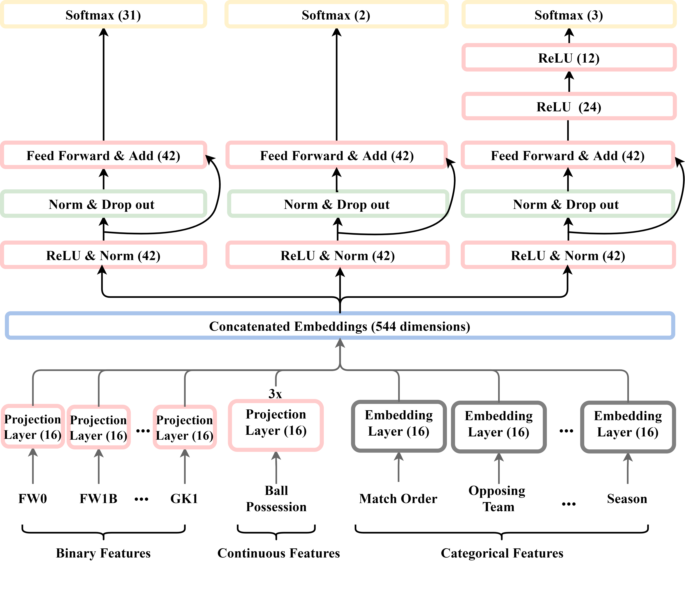

# Multi-Output-model-for-Soccer

## Abstract
In modern sports, strategy and tactics are important in determining the game outcome. However, many
coaches still base their game tactics on experience and intuition. The aim of this study is to predict tactics
such as formations, game styles, and game outcome based on soccer dataset. In this paper, we propose
to use Deep Neural Networks (DNN) based on Multi-Layer Perceptron (MLP) and feature engineering to
predict the soccer tactics of teams. Previous works adopt simple machine learning techniques, such as
Support Vector Machine (SVM) and decision tree, to analyze soccer dataset. However, these often have
limitations in predicting tactics using soccer dataset. In this study, we use feature selection, clustering
techniques for the segmented positions and Multi-Output model for Soccer (MOS) based on DNN,
wide inputs and residual connections. Feature selection selects important features among features of
soccer player dataset. Each position is segmented by applying clustering to the selected features. The
segmented positions and game appearance dataset are used as training dataset for the proposed model.
Our model predicts the core of soccer tactics: formation, game style and game outcome. And, we use
wide inputs and embedding layers to learn sparse, specific rules of soccer dataset, and use residual
connections to learn additional information. MLP layers help the model to generalize features of soccer
dataset. Experimental results demonstrate the superiority of the proposed model, which obtain significant
improvements comparing to baseline models.

## Requirements
The codebase is implemented in Python 3.6.1 | Anaconda 4.6.14 (64-bit). Package versions used for development are just below.

    jsonschema        2.6.0
    numpy             1.19.5
    pandas            0.23.4
    seaborn           0.9.0
    matplotlib        2.2.3
    tensorflow                    2.6.0
    tensorflow-datasets           4.0.1
    tensorflow-estimator          2.6.0
    tensorflow-gcs-config         2.6.0
    tensorflow-hub                0.12.0
    tensorflow-metadata           1.2.0
    tensorflow-probability        0.14.1

## Datasets
We collected two datasets from the website (http://whoscored.com). The first dataset is the soccer player
dataset, as described in Table 2. The second dataset is the game appearance dataset in Table 3. We
combine two datasets into a training dataset. We collect Tottenham Hotspur’s game appearance dataset
for 11 seasons (2010/2011–2020/2021). Our model trains a dataset consisting of 380 games and tests the
model with a dataset consisting of 38 games. The data from 2010/2011 to the 2020/2021 seasons is used
as training data
